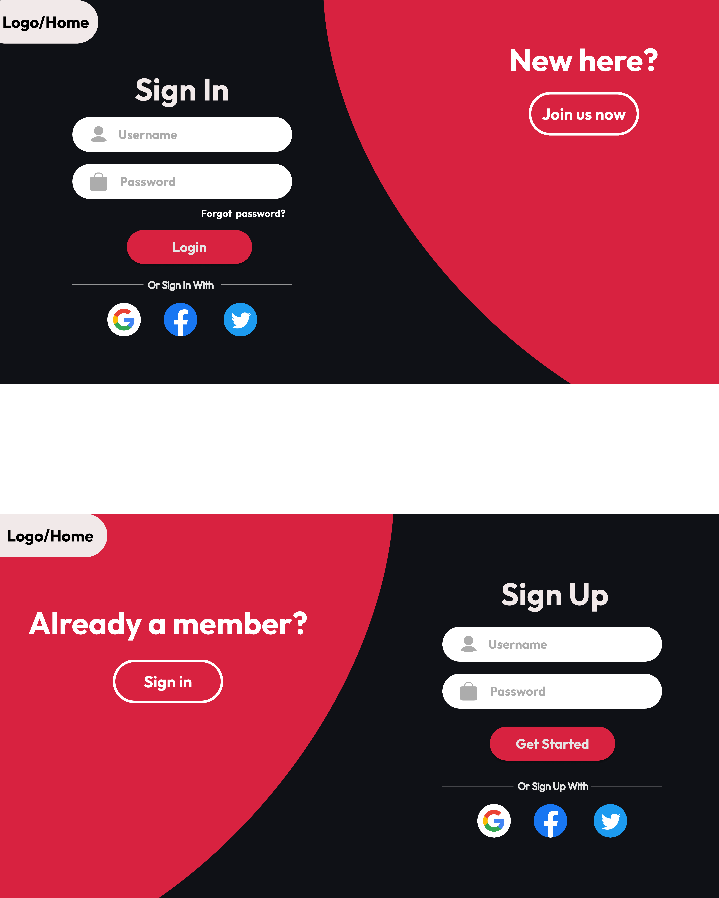
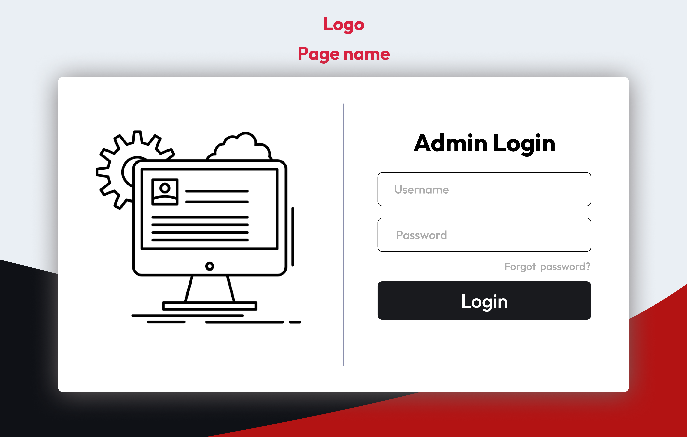
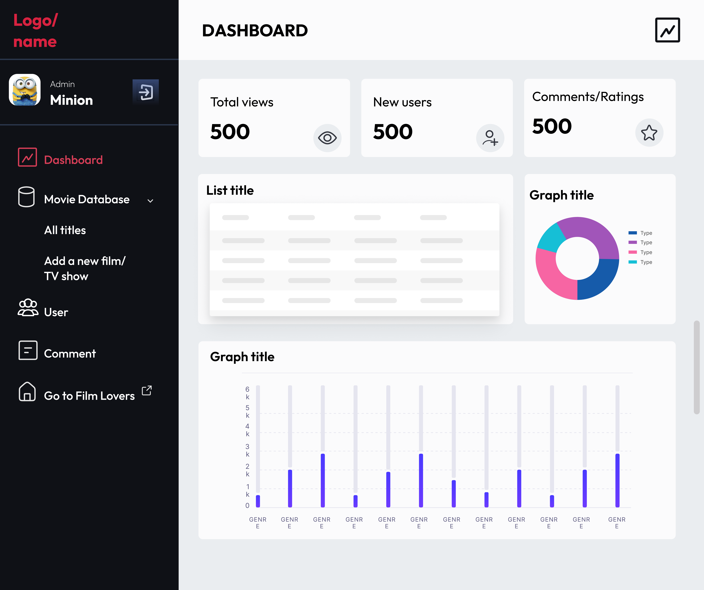
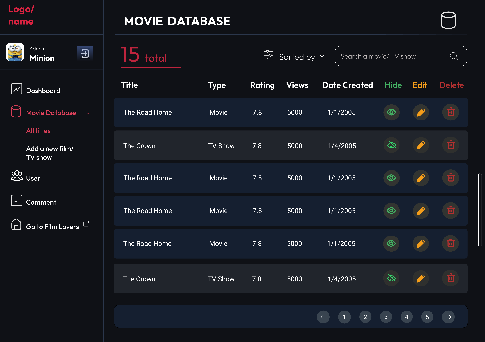
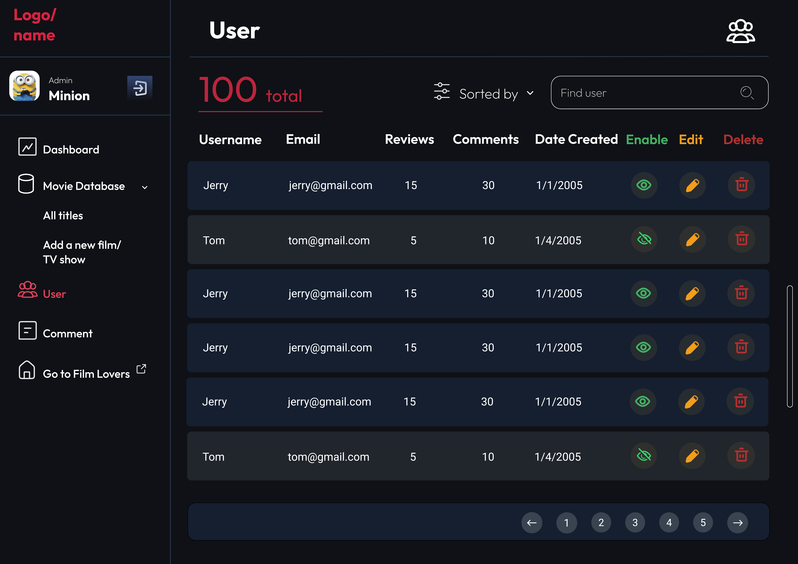
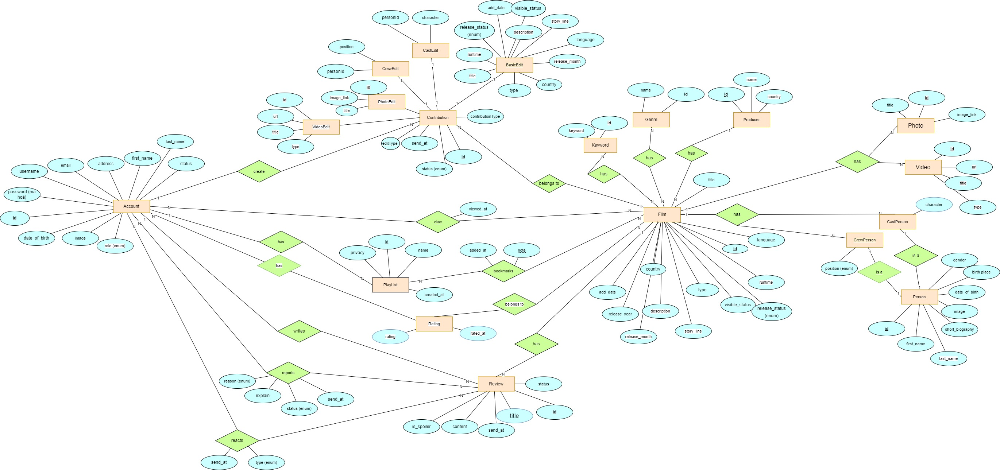
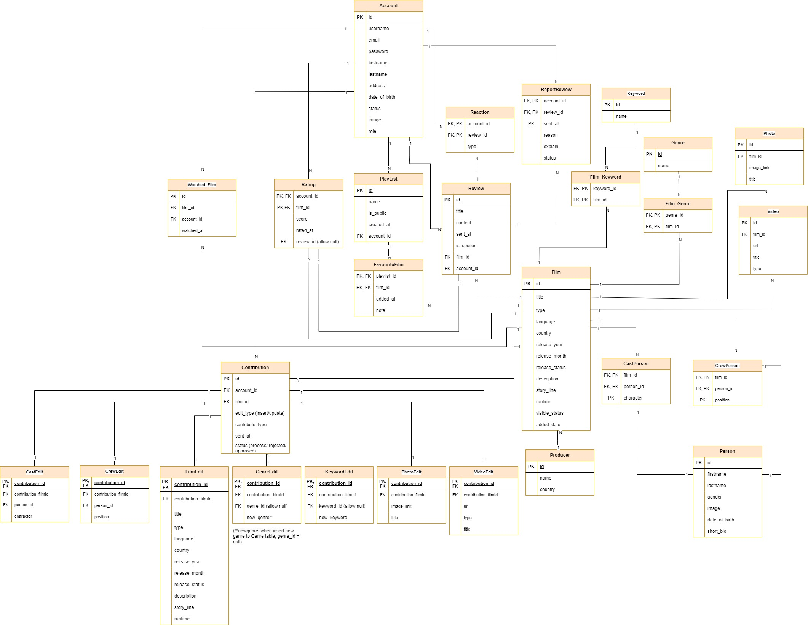
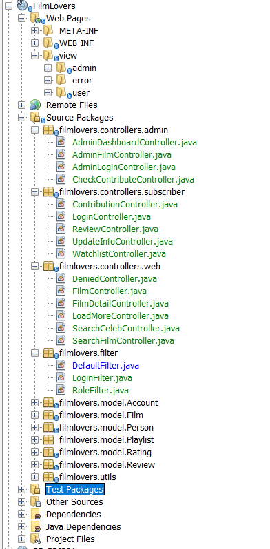
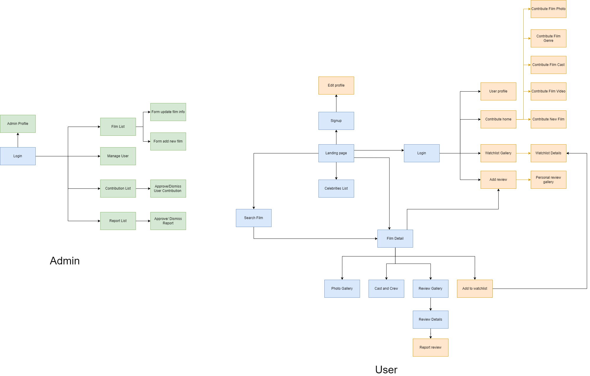

# 🎬 Film Lovers

#### Notice: This is a re-up repository of a project that I worked with my teammates in subject PRJ301 at FPT University, I re-up this project because the original repository was set "private" by my teacher.

## Project Document:

## Mẫu giáo tập code - Group members:
- Võ Thị Mai Hoa - SE183659
- Nguyễn Gia Bảo Anh - SE183425
- Nguyễn Thị Bích Duyên - SE183629
- Trương Quang Hiếu Trung - SE183255

## 1. Requirement: 
### Target users: Film viewers who want to hold the latest information, ratings and reviews of films, tv series, movies...

## Description

- An online web application for viewing latest film information (summaries, trivia, quotes, images..), as well as contributing data, reviews and ratings.   
- This website is focused on creating good users experience in finding/filtering shows and movies, also providing a visually appealing and user-friendly interface for displaying useful information.   
- Accounts are divided into two roles: **Admin** and **User**. If the viewer doesn't login, they are identified as **Guest**.   

### Features

#### Guest:   
- Register for User account: Google account, Facebook account, Register manually (username, email, password)   
- View shows and movies list, information and reviews from Users   
- Change language on page (EN, VI)   
- Change website theme (Dark mode, Light mode)   
- Search for shows and movies by Name   
- Filter the shows and movies by Type, Genre, Country, Release year, Ratings   
- Sort the list in Alphabetical order, Release year order, Ratings order   

#### Subscriber:
- Login: Google account, manually   
- All Guest's features   
- Can see '**View History**': a list of 20 films that user viewed recently    
- Create different **Watchlists** then add, view and remove shows and movies from them   
- Give ratings for shows and movies    
- Leave comments, edit and delete their own comments   
- Like and dislike, report comments of others
- **Contribute** shows and movies based on given form   
- Log out   

#### Admin:
- Login: Google account, manually   
- All Guest's features   
- Create or delete shows and movies, add and update their descriptions, information   
- View users' accounts' details, change account status (able/disable)   
- Approve or disapprove Users' edit suggestions   
- Get the list of comments that are reported by Users, can choose to delete or keep them
- Log out   

## 2.GUI

  
Click me
 
  
  ### 2.1. Common Pages
  
#### a. Sign in & Sign up:

#### b. Home page

#### c. Trending films 

#### d. Film details and Reviews

#### e. Film cast details

### 2.2. Admin Pages

#### a. Login

#### b. Dashboard

#### c. Movie Database

#### d. Add new movie

#### e. Manage users

#### f. Manage comments

## 3. Database Design

  
Click me
 
  
  

## 4. System Design
### a. Project Structure:

### b. Flow chart:

## 5. Conclusion
With the team effort, we have delivered some features of the website:

- Manage multiple models with CRUD functions: Film, Genre, Actor, Video, Photo, Rating, Contribution,...

- Account:
    + Create, view, update, delete user account;
    + Implement Password Hashing function for better security.
      
- Film:
    + Create, view, update, delete, search and filter Films by multiple conditions;
    + Implement Pagination from database for better performance when searching/viewing
    + Use Firebase Cloud storage for data storing (film's photo, user's photo).

- Watchlist:
    + Create many playlist to watch laterr
    + Add favourite films to the playlist
 
- Contribution:
    + Allow users to contribute new films or contribute videos, genres and photos to a existed film
    + Admin check the contribution after user submitted to publish the contribution to the website or reject it

During the coding time, we also spent much time to provide good UI for the functions above.

However, due to our lack of time and skill, we have yet hit the threshold of a smoothly well functioning website:
- Haven't organized the project structure carefully from the start, which leads to inefficient coding process, difficulties in developing and maintaining in the future.
- Many flaws in user flow (Example: only annouce to user but not sending email for them after admin checking contribution)
- Unfinished views (Example: WatchList view in the Landing Page)
- Some unstable methods (Example: Edit Profile View)

And now that we have submitted our assignment, we can reflect on our progress. 
Throughout this project, we learned and strengthened our knowledge not only in tools like Figma, Git, Github, but also in coding techniques and mindset, both front-end and back-end. Looking further, it was all thanks to the advice and feedback of our lecturer that we could see the problems more clearly and figure out the solutions. We are deeply grateful for his help in this tough semester. This is a valuable experience that help us to further our careers in this field. 

